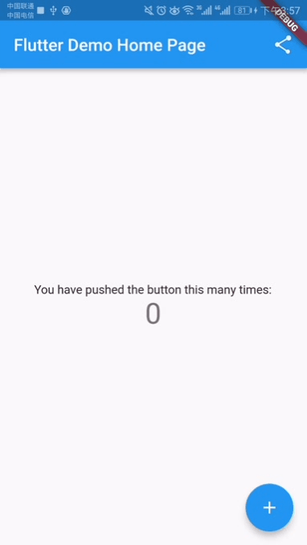

# popup_window

 

A library to display a view like window in android native.
## Getting Started

**1.Install**
```yaml
dependencies:
  popup_window: ^1.0.0+7
```

**2.Import**

```dart
import 'package:popup_window/popup_window.dart';
```

**3.Usage**
```
/// windowHeigh = 200;
PopupWindowButton(
  offset: Offset(0, windowHeight),
  /// recommend, use buttonBuilder instead.
  buttonBuilder: (BuildContext context) {
    return PopupWindowBtn();
  },
  /// recommend, use windowBuilder instead.
  windowBuilder: (Widget child, Animation<double> animation,
     Animation<double> secondaryAnimation) {
    return FadeTransition(
      opacity: animation,
      child: SizeTransition(
        sizeFactor: animation,
        child: Container(
          color: Colors.greenAccent,
          height: windowHeight,
        ),
      ),
    );
  },
  onWindowShow: () {
    print('PopupWindowButton window show');
  },
  onWindowDismiss: () {
     print('PopupWindowButton window dismiss');
  },
)
```

More detail see example: main.dart
